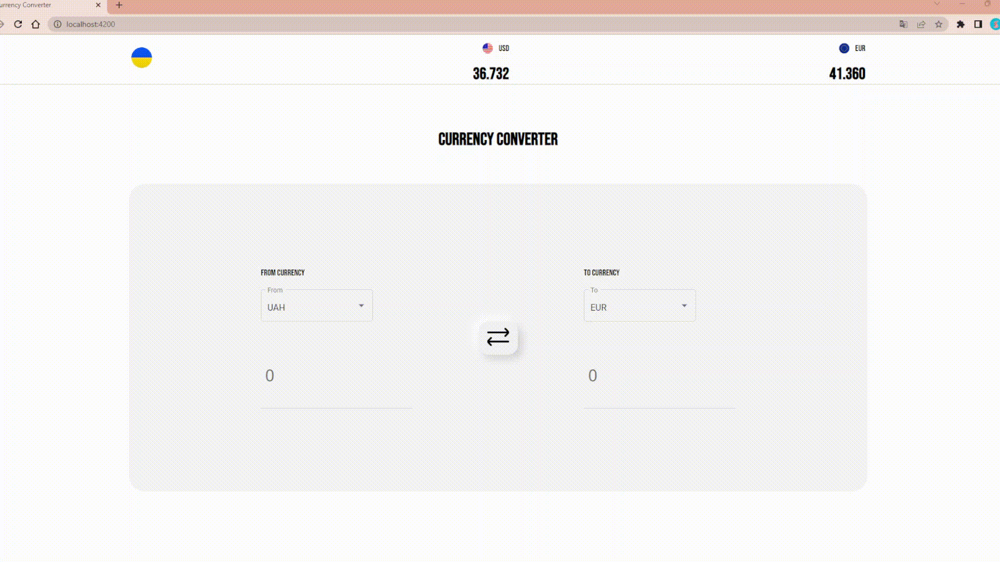

# Currency Converter SPA

This application is a simple currency converter built with Angular. It uses the [ExchangeRate.host](https://exchangerate.host/#/) public API for currency conversion.

## Demo Video

.

## Features

- **Currency Rate Display**: The application header displays the current exchange rate for USD and EUR in relation to UAH.
  
- **Currency Conversion Component**: The application provides two input fields along with a corresponding select field for each currency. The input field allows users to specify the amount of currency to be converted. The select field allows users to choose one of some currencies: UAH, USD, EUR, and more.

- **Two-way Conversion**: The application supports two-way conversion. If the amount in the first currency input is changed, the corresponding amount in the second currency is recalculated, and vice versa. Similarly, changing the currency in any select field triggers a recalculation of the conversion for both currencies.

## Additional Features

- **Responsive Design**: The application is mobile-ready and adjusts seamlessly to different screen sizes for optimal viewing and interaction.
  
- **Accessibility**: The application is built with accessibility considerations in mind.

- **Unit Tests**: The application includes a set of unit tests to verify its functionality and reliability.

- **Pleasant UI**: The application features a user-friendly interface.

- **Clean Code**: The codebase is clean and well-organized, following best practices for maintainability and readability.

## Getting Started

To run this application:

1. Clone the repository.
2. Run `npm install` to install the dependencies.
3. Run `ng serve` to start a dev server. Navigate to `http://localhost:4200/` in your browser. The app will automatically reload if you change any of the source files.
4. Run `ng test` to execute the unit tests via [Karma](https://karma-runner.github.io).

